a

 <h1 align="center">Project on Programmable Logic Controller</h1>

# Introduction
This project designs and constructs a product classification model by color using PLC Simens S7-1200 combined with image processing applications. In this project, we use Computer Vision to detect three different colors such as Yellow, Blue and Purple. After that, we communicate with PLC S7-1200 through Modbus TCP/IP Protocol. The version of TIA Portal is v16.

# System design and construction
The product classification system by color works on the basis of processing color scanned images of each product. The colors are sent to the computer and processed and then put into the PLC, the PLC is responsible for processing and emitting signals to control the cylinder to push the product into the corresponding container. Products that are not among the products that need to be sorted are taken to the end of the conveyor and dropped into the defective product container. This system is repeated continuously along with packaging, labeling and storage lines to create a complete production line of the factory.

The hardware of the system includes: control devices (PLC, relay), actuators, motors, conveyors, pneumatic cylinders, Camera Logitech C270, sensors.

  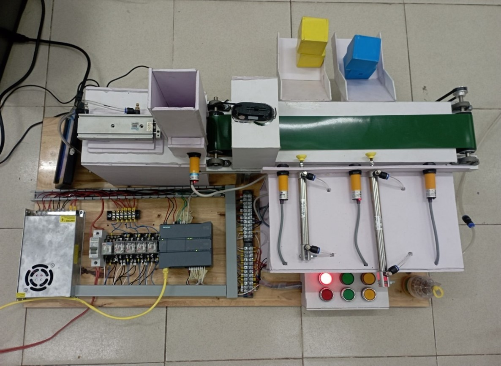 
  <i>System model built</i>

The system algorithm flowchart is shown below:

  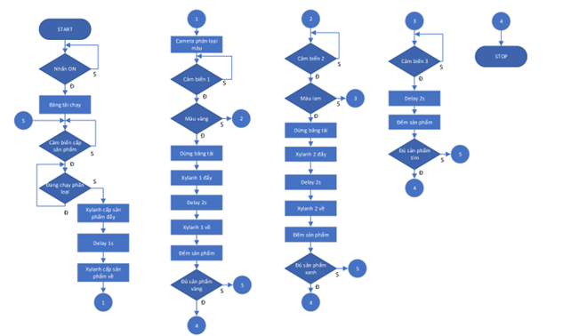 

The system wiring diagram is as follows:

  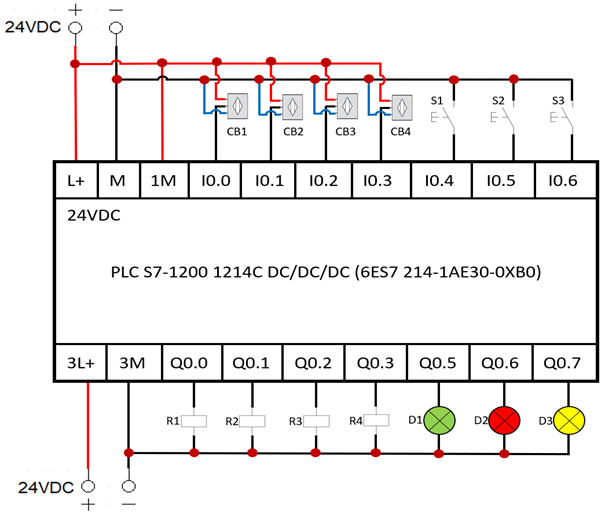 
  <i>Connection diagram of PLC control circuit</i>

  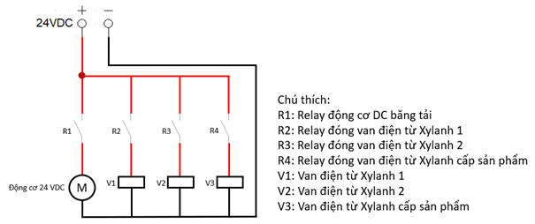 
  <i>Connection diagram of motor dynamic circuit and cylinder solenoid valve</i>

# Control interface design
The interface is designed by the team using the Python programming language.

  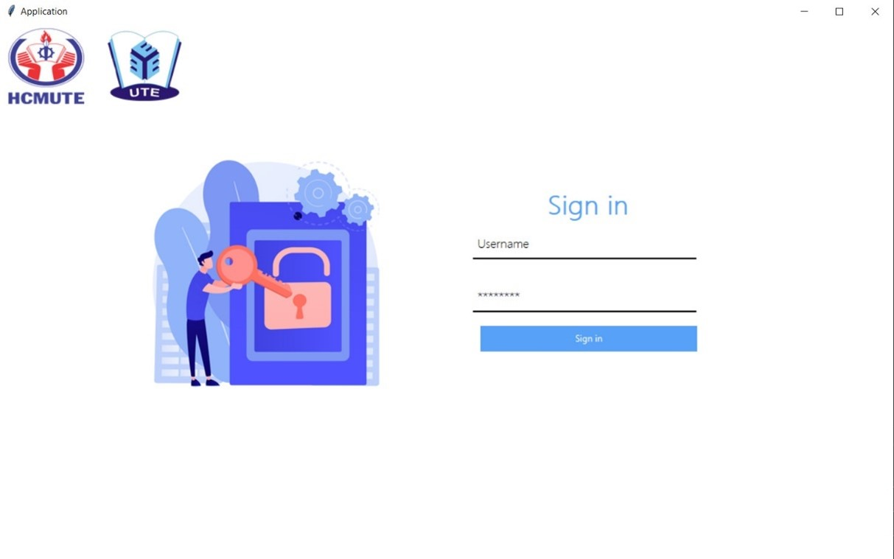 
  <i>Python login interface</i>

  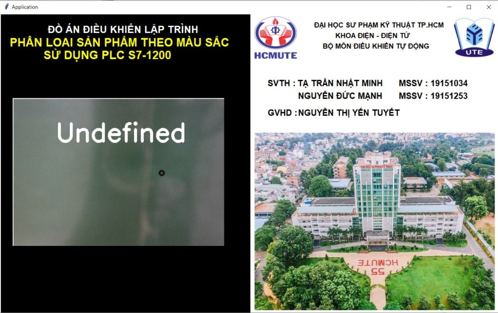 
  <i>Color Observation Interface on Python</i>

# Create a monitoring interface on WinCC

  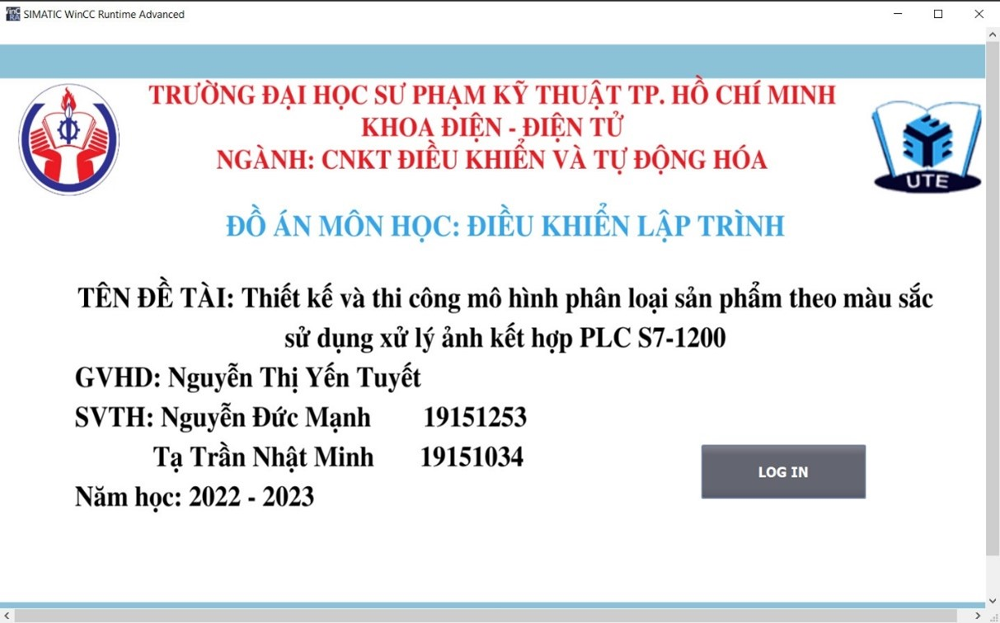 
  <i>Main interface of the system on WinCC</i>

  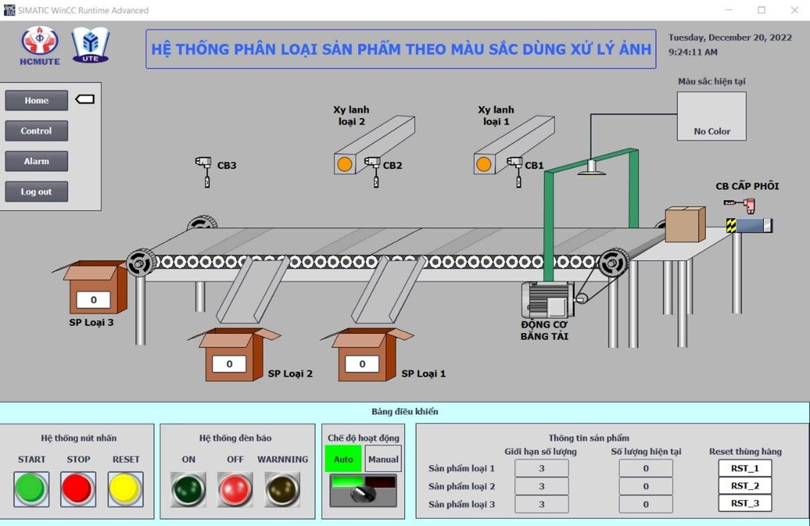 
  <i>System control and monitoring interface on WinCC</i>

# Experimental results

  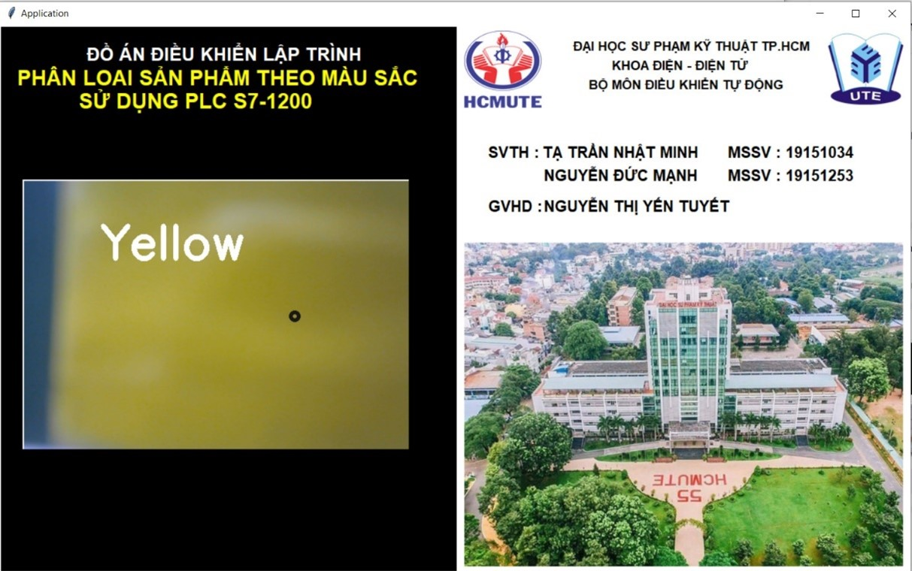 
  <i>Camera results identify yellow products</i>

  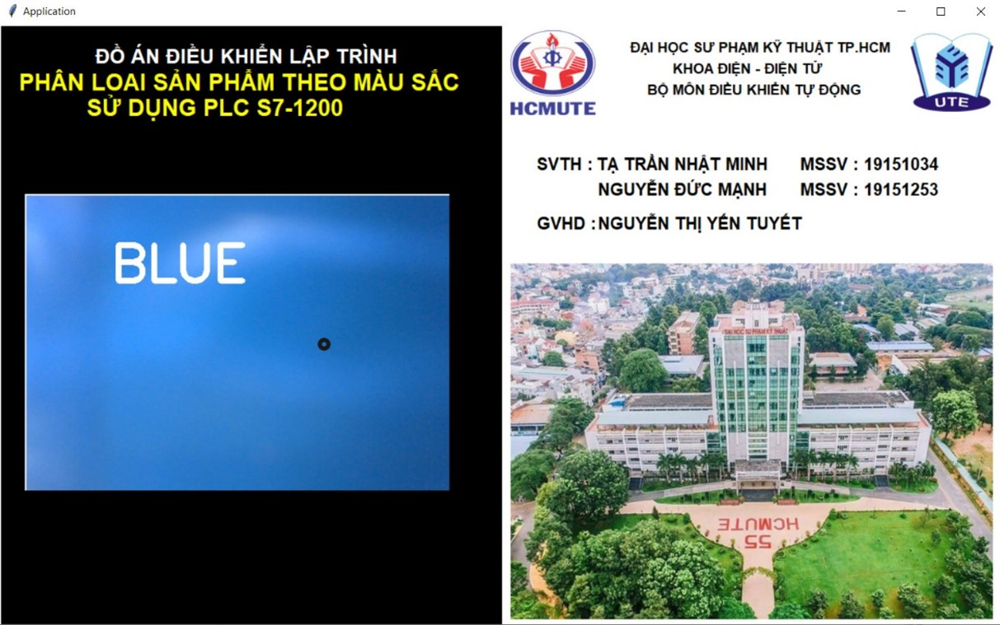 
  <i>Camera results identify blue products</i>

  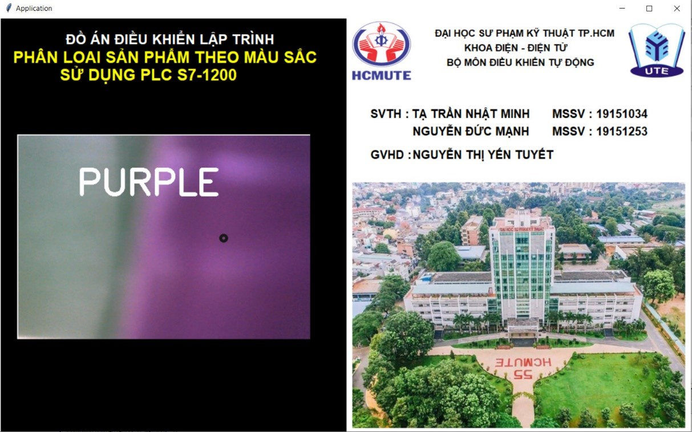 
  <i>Camera results identify purple products</i>

  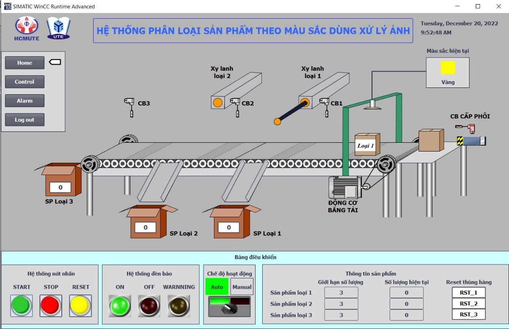 
  <i>WINCC Sorted Product Push Cylinder</i>

  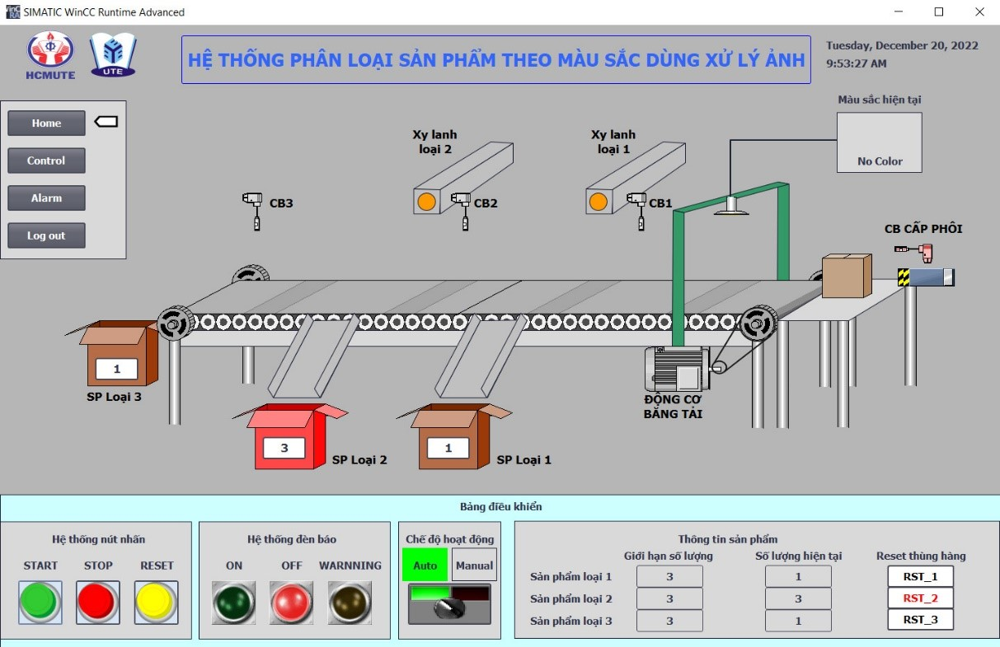 
  <i>Number of products in each carton after sorting on WINCC</i>

# Video
For more detail, you can watch the Video show how the system operating: https://youtu.be/-eSwlSKctss
