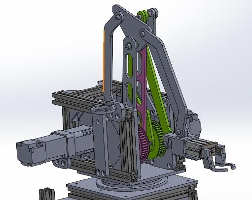

 <h1 align="center">Design and build a bottle processing system using S7-1200 and Magician robotic arm </h1>

# Introduction
This project involves the design and construction of a system for filling, capping, and arranging glass bottles. The system employs a Magician robotic arm to organize the bottles into a 3x3 grid within a square container. The manufacturing line, equipped with conveyors, pumps, and pneumatic cylinders, is responsible for the filling and capping of the bottles.

The system is controlled by a Siemens SIMATIC S7-1200 CPU 1214C PLC, which also manages the Mitsubishi AC Servo MR-J3 motors. Despite the differences between the two brands, successful integration has been achieved. The PLC is capable of reading the AC Servo’s absolute encoder, enabling the robot to automatically home itself when powered on. This simplifies the initialization process and enhances the overall efficiency of the system.

# System design and construction
Design the whole system, we need a reliable tool that can connect all the parts. That’s why we use SolidWorks 2022 It helps us complete and integrate each stage smoothly.
This part talks about the designs of each part of a system that fills, seals, and caps bottles. We’ll look at the design of the Magician Robotic Arm in Section 3.2.3.
Figure 3-10 presents an overview of the motors’ positions in the system. Each component represents a stage in the production line.

The hardware of the system includes: control devices (PLC, relay), actuators, motors, conveyors, pneumatic cylinders, Camera IMC-3616UC, sensors.

   
  <i>Top view of the system</i>

   
  <i>Front view of the system</i>

Overview of the project:

   

Design of the Electrical cabinet:

   
  <i> Left side view of cabinet</i>

   
  <i> Overview of the actual electrical cabinet</i>

Programmable Logic Controller (PLC): This is the main control unit, responsible for automating various functions.
Circuit Breakers (CB): These are located at the top of the cabinet and protect the circuit from damage caused by excess current from an overload or short circuit.
Servo Drive: Positioned in the middle of the cabinet, this controls the operation of the servo motor.
Intermediate Relays: These devices control the power circuits.
AC to DC Converters: There are two converters, one for 12V and another for 24V, which convert alternating current (AC) to direct current (DC).
Terminal Blocks: These secure and/or terminate multiple wire connections.
Fans: Two 12V fans, each running at 1500 RPM and measuring 12x12 cm, are installed for cooling purposes.

   
  <i>Magician Robot Arm model by SolidWorks</i>

# Control interface design
The interface is designed by the team using the C# programming language.

   
  <i>Product interface without cover</i>

   
  <i>The product interface has a cap and a filled bottle</i>

# The system wiring diagram

   
  <i>Wiring diagram of other actuators and sensors</i>

   
  <i>Wiring diagram for Joint 1 of the robotic arm</i>

   
  <i>Wiring diagram for Joint 2 of the robotic arm</i>

   
  <i>Wiring diagram for Joint 3 of the robotic arm</i>

 # 
# Experimental results
Initially, empty bottles are placed on the input conveyor and pushed towards the end of the conveyor to fill water into the bottles

   
  <i>Bottles in the input conveyor</i>

   
  <i> Filling water into a bottle</i>

   
  <i>Capping a bottle</i>

   
  <i>Cap before it is capped</i>

   
  <i>Pneumatic cylinder is capping the bottle</i>

   
  <i>Bottles are delivered to the output conveyor</i>

   
  <i>A pneumatic cylinder grips bottle</i>

   
  <i>Robotics Arm puts the bottles into the storage</i>

# Video
For more detail, you can watch the Video show how the system operating: https://youtu.be/p6lmQUOT4Mk?si=QC_-EGU05_skhJYb
